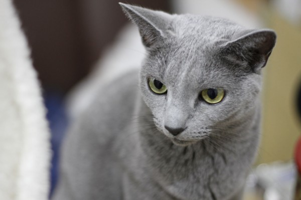

### Tensorflowで
### ネコの画像認識をつくってみた

+++
### Who?


- Name: N.U|
- Joined Company: 2009年|
- Work: システム構築PL && DevOps|
- Hot: GoLang!|

+++
### 前提
- インフラ・運用エンジニアです|
- 機械学習ははじめてです|
- 数学や統計学も初心者です|
- 言語はPHP/JavaScript/Perlなど|

+++
### 機械学習って流行ってますよね！
- ニュース|
- サービス|
- 情報は聞くけどさわったことない|
- 本当に使えるレベルで動くの？🙄|

+++
### これから話すこと
- 機械学習初心者がTensorflowを試して…|
- 良かったこと|
- 大変だったこと|

+++
### 話さないこと
機械学習の統計とか数学的な話📊

+++
### Tensolflow?
- 「深層学習（ディープラーニング）を行えるライブラリ」
- 詳しいことはWebで！

+++
### やったこと
- ネコの画像をスクレイピング|
- 画像を学習させる|
- お題となる画像を与えて認識できるかチェックしてみる|

+++
### イメージ


```

python3 /usr/local/tf/label_image.py --image cat1.jpg --graph /usr/local/tf/retrained_graph.pb

```
結果が返ってくる！
```
russianblue 0.7167683
americanshorthair 0.15780476
munchkin 0.0629924
mikanecat 0.047680147
persia 0.014754322
```

+++
### 環境
- GCP VMインスタンス：n1-standard-1(vCPU x 1、メモリ 3.75 GB)
- OS：Debian 4.9
- Python：3.5.3


+++
### チュートリアルにそって実装


+++
### まずはスクレイピング
```
pip3 install google_images_download
googleimagesdownload -k "Scottish Fold"
```
@[1]
@[2]

+++
### 画像をとってきた！
```
-rw-r--r-- 1 xxx xxx   19369 Sep 16 09:04 18. scottish_fold2.jpg
-rw-r--r-- 1 xxx xxx    5604 Sep 16 09:04 16. 220px-white_scottishfold.jpg
-rw-r--r-- 1 xxx xxx  688222 Sep 16 09:04 99. 6.jpg
-rw-r--r-- 1 xxx xxx   75596 Sep 16 09:04 95. scottish_fold_white_550x367.jpg
-rw-r--r-- 1 xxx xxx  140625 Sep 16 09:04 82. angus.jpg
-rw-r--r-- 1 xxx xxx   10598 Sep 16 09:04 68. scottish334.jpg
-rw-r--r-- 1 xxx xxx  201425 Sep 16 09:04 44. animal023_0702_4k.jpg
-rw-r--r-- 1 xxx xxx   24863 Sep 16 09:04 38. 250px-scottish_fold_cat.jpg
-rw-r--r-- 1 xxx xxx   42854 Sep 16 09:04 35. fabio-petroni-scottish-fold-cat_a-g-13454525-14258384.jpg
-rw-r--r-- 1 xxx xxx   54599 Sep 16 09:04 15. 1.jpg
-rw-r--r-- 1 xxx xxx  117165 Sep 16 09:04 11. 16979752-curious-striped-scottish-fold-kitten.jpg
-rw-r--r-- 1 xxx xxx  715242 Sep 16 09:04 10. scottish-fold-cats-michael-d3f35258_cfa6cf2b.jpg
-rw-r--r-- 1 xxx xxx   17777 Sep 16 09:04 55. scottish-fold-1.jpg
-rw-r--r-- 1 xxx xxx  233039 Sep 16 09:04 50. adult-male-blue-scottish-fold-cat-with-golden-eyes-standing-looking-picture-id505322557.jpg
```
30種類（人気順）×100枚
+++
### 選別する

+++

+++

+++
#### ＿人人人人人人人人人人人＿
#### ＞　これはネコじゃない　＜
#### ￣Y^Y^Y^Y^Y^Y^Y^Y^Y^Y￣

+++
### Tensorflowのインストール
```
sudo apt-get install -y git build-essential libssl-dev language-pack-id
pip3 install --upgrade pip
pip3 install tensorflow
```
@[1]
@[2]
@[3]
+++
### 学習させる

```
python3 retrain.py \
  --bottleneck_dir=bottlenecks \
  --how_many_training_steps=100 \
  --model_dir=inception \
  --summaries_dir=training_summaries/basic \
  --output_graph=retrained_graph.pb \
  --output_labels=retrained_labels.txt \
  --image_dir=gakusyu_data
...
```
@[3](training_steps：学習回数)
@[8](gakusyu_data：学習させる画像フォルダ)

+++
### ファイル名のエラー
```

OSError: [Errno 36] File name too long: "bottlenecks/British Shorthair/85. pet-cat-mammal-whiskers-vertebrate-british-shorthair-european-shorthair-chartreux-russian-blue-korat-cat-mia-small-to-medium-sized-cats-cat-like-mammal-domestic-short-haired-cat-american-shorthair-blue-cat's-743876.jpg_https~tfhub.dev~google~imagenet~inception_v3~feature_vector~1.txt"

```
ファイル名が長いらしい。mvで置換。
+++
### こんどはファイルサイズ
```
RuntimeError: Error during processing file gakusyu_data_max/Singapura cat/4. moonwalker_the_singapura.jpg (Invalid JPEG data or crop window, data size 1671168
	 [[Node: DecodeJpeg = DecodeJpeg[acceptable_fraction=1, channels=3, dct_method="", fancy_upscaling=true, ratio=1, try_recover_truncated=false, _device="/job:localhost/replica:0/task:0/device:CPU:0"](_arg_DecodeJPGInput_0_0)]]
```  
@[fragment-range]
今度はファイルサイズ。大きいサイズの画像は消す。

+++
### いよいよ画像を認識できるか試してみる
```
python3 label_image.py --xxx.jpg --graph retrained_graph.pb --labels retrained_labels.txt
```

+++

### 結果が5種類しかでない
```
egyptianmau: 0.66
bengal: 0.07
american shorthair: 0.05
singapura cat: 0.04
abyssinian: 0.03
```
🤔🤔🤔🤔🤔

+++
### 調べた結果・・・
label_image.py
```
top_k = results.argsort()[-5:][::-1] #上位5件のみ
labels = load_labels(label_file)
for i in top_k:
  print(labels[i], results[i])
```
```
top_k = results.argsort()[::-1]
labels = load_labels(label_file)
for i in top_k:
  print('{}: {:.2f}'.format(labels[i], results[i]))
```
デフォルトでは5件のみでソートしているため、変更。

+++
### 学習回数をかえてみる
100→500の変化。すごい。


```
persia 0.124754322
```
```
persia 0.291819281
```

+++
### ネコの違いは判別できたか？
- 似てる種類はわからない。
- むしろあってるかどうかよくわからない。
- 明確な違いがある動物でやるといいかも。

+++
### まとめ
cons
- 壁が結構多い。
- 公式ドキュメントは英語のみ。

pros
- 動く。楽しい。
- 大変さが実感できる。

+++
### Webにしてみました


+++

### これからやりたいこと

tensorflow.js(2018/05公開) 

使ってみたい💪

+++
### END

